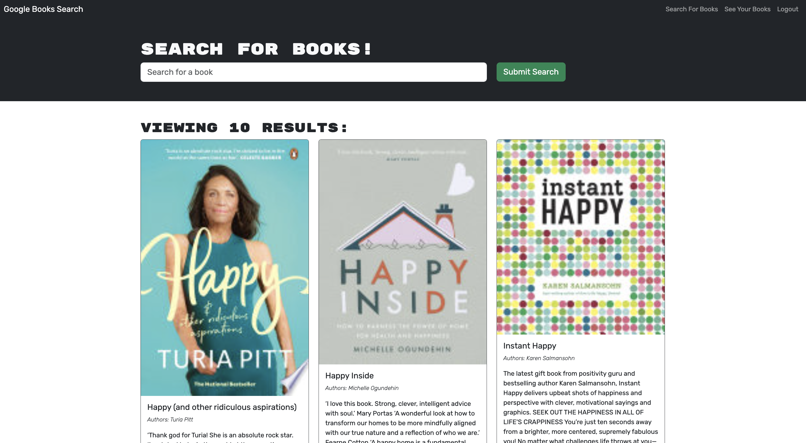

# Google Books Search Engine with GraphQL

## Description
This project is a Google Books search engine built using the MERN stack (MongoDB, Express.js, React, Node.js), with a GraphQL backend powered by Apollo Server. Users can search for books, view search results, save books to their account, and manage their saved books list. Visit the deployed application [here](https://retnodamayanti.github.io/react-portfolio/)

## Table of Contents

- [Description](#description)
- [Features](#features)
- [Installation](#installation)
- [Usage](#usage)
- [Technologies Used](#technologies-used)
- [License](#license)
- [Contact](#contact)
## Features

- Search for books using the Google Books API.
    

    
    

- Sign up and log in with user authentication.
- Save and remove books from your account.
- View and manage your list of saved books.
    

    
    

## Installation

1. Clone the repository
2. Navigate to the project directory: `cd book-search-engine`
3. Install server and client dependencies: `npm install`. This command will navigate into both the server and client directories and install the required dependencies for each part of the application.

## Usage

1. Once you have the project installed, you can start the development environment by running the following command: `npm run develop`. This command utilizes the concurrently package to run both the server and client concurrently. The server will automatically restart when changes are made, and the client development server will be available at `http://localhost:3000`.
2. To build the production-ready client bundle, you can use the following command: `npm run build`. This will generate an optimized build of the React app in the client/build directory.
3. Finally, you can start the application in production mode by running: `npm start`.
Note: Before running the application in production, make sure to set up the appropriate environment variables and configurations as needed for your deployment environment.

## Technologies Used

- React: Frontend user interface and components
- Apollo Server: GraphQL API server
- MongoDB: Database for storing user data and saved books
- Express.js: Backend server framework
- Node.js: JavaScript runtime environment
- Google Books API: External data source for book information
- Bootstrap: Frontend styling and layout

## License

Please refer to the LICENSE in the repo.

## Contact

If you have any questions or suggestions, feel free to contact me:

Email: <mayahere5@gmail.com>
GitHub: retnodamayanti